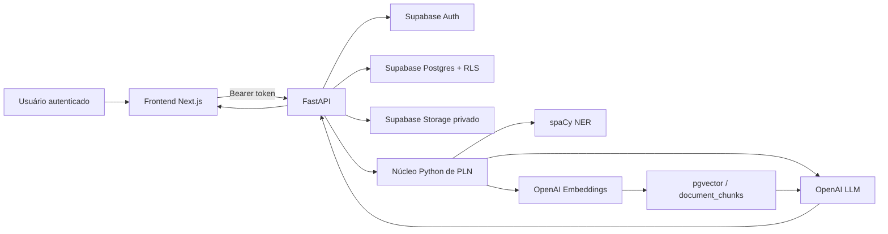
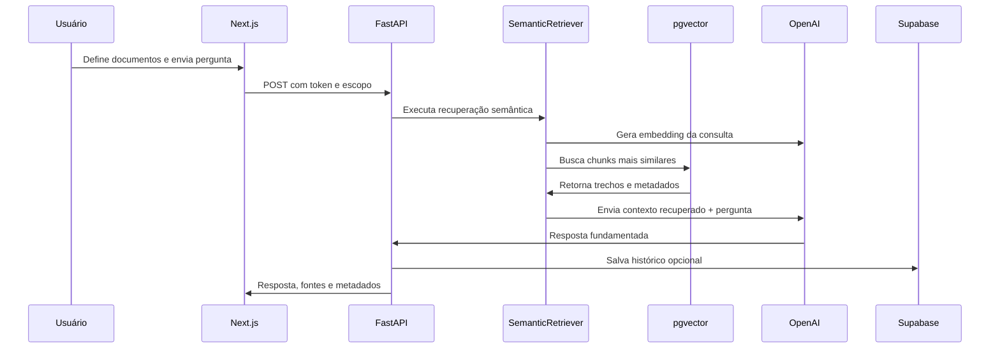

# Synapse AI

> Plataforma acadêmica de Inteligência Organizacional com Processamento de Linguagem Natural, Recuperação Aumentada por Geração (RAG) e rastreabilidade de evidências.


## 1. Resumo executivo

O **Synapse AI** é uma plataforma de inteligência organizacional desenvolvida para a disciplina de Processamento de Linguagem Natural da pós-graduação. Seu objetivo é converter documentos institucionais dispersos em uma base de conhecimento pesquisável, auditável e útil para a tomada de decisão.

A plataforma recebe documentos, extrai e normaliza seu conteúdo, identifica entidades relevantes, indexa trechos semanticamente e permite consultas em linguagem natural com indicação das fontes que sustentam cada resposta. A partir desse mesmo contexto documental, oferece análises de sentimentos organizacionais, alertas preventivos e planos de ação orientados por evidências.

O projeto evoluiu de um protótipo inicial em Streamlit para uma arquitetura web desacoplada, composta por frontend em Next.js, API em FastAPI, Supabase como plataforma de dados e OpenAI como provedor de modelos de linguagem e embeddings. O Streamlit foi preservado no repositório como referência histórica e funcional durante a migração.

## 2. Problema investigado

Em organizações, informações críticas costumam permanecer fragmentadas entre atas, apresentações, e-mails, planilhas, relatórios, transcrições e exportações de ferramentas operacionais. Essa dispersão provoca dificuldades recorrentes:

- busca lenta e dependente de conhecimento individual;
- perda de contexto entre decisões, responsáveis, prazos e riscos;
- baixa rastreabilidade sobre a origem de recomendações;
- dificuldade para comparar documentos ou identificar inconsistências;
- atraso na transformação de informação em ação executiva.

O Synapse AI enfrenta esse problema por meio de uma arquitetura que prioriza **extração de informação**, **recuperação semântica**, **respostas fundamentadas em fontes** e **isolamento de dados por usuário**.

## 3. Objetivos acadêmicos

### Objetivo geral

Construir um MVP de PLN capaz de organizar conhecimento institucional não estruturado e apoiar consultas e análises documentais com transparência sobre as evidências utilizadas.

### Objetivos específicos

1. Receber e extrair texto de múltiplos formatos documentais.
2. Aplicar reconhecimento de entidades nomeadas para enriquecer metadados de contexto.
3. Dividir documentos em trechos semanticamente recuperáveis.
4. Gerar embeddings e executar busca vetorial com `pgvector`.
5. Implementar RAG para responder perguntas com fontes recuperadas.
6. Gerar Plano de Ação, Análise de Sentimentos e Alertas Preventivos a partir da base documental.
7. Preservar histórico e trilha de evidências para auditoria.
8. Demonstrar princípios de segurança, autenticação e isolamento de usuários em um produto web.

## 4. Escopo do MVP

### Entregas principais

- autenticação por e-mail e senha com Supabase Auth;
- segregação de dados por conta, com Row Level Security no Supabase;
- upload, extração e armazenamento privado de documentos;
- suporte a PDF, DOCX, PPTX, XLSX, TXT, MD, CSV, JSON, VTT, EML, MP3, M4A e WAV;
- leitura estruturada de exportações de Jira, Slack e Teams em formatos de arquivo;
- transcrição de áudio para conteúdo pesquisável;
- identificação de entidades como pessoas, organizações, datas e valores;
- chunking, embeddings e busca vetorial;
- seleção explícita do escopo documental da análise;
- RAG com citações de fontes e similaridade;
- Estúdio de IA com Plano de Ação, Sentimentos Organizacionais e Alertas Preventivos;
- Copiloto contextual;
- Dashboard, Insights e Trilha de Evidências;
- geração de relatórios e exportações;
- frontend responsivo em Next.js e API FastAPI publicada.

### Limites assumidos

O projeto é um **MVP acadêmico**, não uma solução corporativa plenamente homologada. Conectores diretos de Microsoft Teams e SharePoint requerem credenciais e consentimento de administrador de uma organização Microsoft 365. Jira, CRM e ERP são suportados por meio de exportações de arquivos, mas seus conectores diretos permanecem como evolução futura.

## 5. Fundamentos de PLN aplicados

| Conceito | Aplicação no Synapse AI | Resultado esperado |
| --- | --- | --- |
| Extração de texto | Parsers por formato e transcrição de áudio | Conteúdo textual normalizado para processamento |
| Reconhecimento de Entidades Nomeadas (NER) | spaCy antes da indexação semântica | Pessoas, organizações, datas e valores em metadados |
| Segmentação em trechos | Chunking com sobreposição controlada | Contexto recuperável sem exceder limites de modelo |
| Representação vetorial | Embeddings gerados pela OpenAI | Similaridade semântica entre pergunta e documento |
| Recuperação de informação | Consulta vetorial em `document_chunks` | Seleção dos trechos mais relevantes |
| RAG | LLM recebe apenas evidências recuperadas | Resposta contextualizada com fontes |
| Análise de sentimentos | Leitura orientada a urgência, tensão, confiança e conflito | Sinais organizacionais, não diagnóstico individual |
| Extração de informação | Decisões, riscos, prazos, responsáveis e pendências | Base para alertas e planos de ação |

### Estratégia para reduzir alucinação estrutural

O Synapse AI não trata uma resposta de LLM como uma fonte autônoma de verdade. A resposta é precedida por recuperação semântica de trechos vinculados a documentos do usuário. As fontes incluem identificador do documento, trecho, índice e score de similaridade. O backend também expõe uma avaliação de **precisão de contexto**, útil para verificar se os chunks recuperados correspondem aos termos ou ao cenário esperado em uma consulta de teste.

## 6. Arquitetura



### Camadas e responsabilidades

| Camada | Diretório | Responsabilidade |
| --- | --- | --- |
| Interface moderna | `frontend/` | Navegação, autenticação cliente, estados de carregamento e experiência do usuário |
| API | `backend/` | Validação, autenticação, rotas REST, CORS e adaptação das respostas |
| Aplicação | `src/synapse_ai/application/` | Casos de uso, comandos, resultados e orquestração |
| Recuperação semântica | `src/synapse_ai/application/retrieval/` | Embedding da consulta, busca vetorial e construção de fontes |
| Serviços | `src/synapse_ai/services/` | Extração, parsing, NER, chunking, conectores, análises e persistência |
| Persistência | `supabase/schema.sql` | Tabelas, funções vetoriais, políticas RLS e storage privado |
| Interface legada | `src/synapse_ai/ui/` | Referência Streamlit preservada durante a migração |

### Fluxo de uma pergunta com fontes



## 7. Fluxo funcional do produto

1. O usuário cria uma conta ou entra na plataforma.
2. Envia um documento local ou conecta uma fonte corporativa autorizada.
3. O backend valida o arquivo, extrai o texto e registra metadados.
4. O arquivo original é armazenado em bucket privado quando aplicável.
5. No Estúdio de IA, o usuário escolhe o escopo documental e prepara a base.
6. O pipeline divide o conteúdo em chunks, aplica NER, gera embeddings e persiste os vetores.
7. O usuário escolhe um fluxo analítico ou formula uma pergunta.
8. A recuperação vetorial localiza evidências relevantes apenas no escopo selecionado.
9. A IA produz uma resposta contextualizada e vinculada às fontes.
10. Resultados salvos podem alimentar Insights, Auditoria e histórico institucional.

## 8. Funcionalidades por área

### Base documental

- ingestão local de documentos;
- detecção de duplicidade por conteúdo dentro da mesma conta;
- extração de texto e metadados;
- persistência isolada por usuário;
- download do arquivo original quando disponível;
- integração OAuth preparada para Google Drive e Slack;
- área corporativa recolhida na interface para reduzir carga cognitiva.

### Estúdio de IA

O MVP concentra o Estúdio em três fluxos de alto valor para a apresentação:

- **Plano de Ação:** organiza tarefas, responsáveis, prazos, riscos e critérios de aceite;
- **Sentimentos Organizacionais:** identifica sinais de urgência, tensão, confiança, conflito e percepção de risco no conteúdo institucional;
- **Alertas Preventivos:** destaca dependências, prazos críticos, pendências, responsáveis ausentes e lacunas de evidência.

Cada fluxo exige documentos selecionados e base semântica preparada. A preparação não precisa ser repetida a cada pergunta: ela só é necessária após incluir documentos novos, alterar o escopo ou atualizar a indexação.

### Insights e evidências

- KPIs executivos;
- consolidação de alertas, planos e achados;
- navegação por evidências recuperadas;
- histórico de análises;
- exportações compatíveis com a auditoria acadêmica do resultado.

### Copiloto Synapse

O Copiloto atua como assistente de produto e orientação contextual. Recebe a área atual, o caminho de navegação e, quando disponível, o identificador do documento selecionado. A busca semântica pode ser restrita a esse documento para evitar mistura de contextos não relacionados.

## 9. Modelo de dados e segurança

As principais entidades estão definidas em [`supabase/schema.sql`](supabase/schema.sql):

- `profiles`: perfil vinculado ao usuário autenticado;
- `documents`: arquivo, texto extraído, status, metadados e referência de storage;
- `document_chunks`: trechos, embeddings e metadados de PLN, incluindo entidades;
- `analyses`: perguntas, respostas, fontes e artefatos analíticos;
- registros de conexão de integrações, quando habilitados.

### Controles aplicados

- Supabase Auth para identidade;
- token Bearer obrigatório nas rotas protegidas da API;
- Row Level Security para documentos, chunks e análises;
- clientes Supabase com escopo do token do usuário;
- storage privado com caminhos associados ao `user_id`;
- credenciais OAuth protegidas no backend;
- chaves fora do Git, em variáveis de ambiente ou arquivos locais ignorados;
- conectores projetados com escopos de leitura e autorização explícita.

> **Importante:** credenciais usadas durante demonstrações devem ser rotacionadas antes de qualquer abertura pública ampla ou comercialização do produto.

## 10. Stack tecnológica

### Frontend

- Next.js 15;
- React 19;
- TypeScript;
- Tailwind CSS;
- Supabase JavaScript SDK;
- Playwright para testes E2E.

### Backend e núcleo de PLN

- Python 3.11+;
- FastAPI e Pydantic;
- Uvicorn;
- OpenAI Python SDK;
- spaCy;
- Supabase Python SDK;
- `pgvector`;
- `pypdf`, `python-docx`, `openpyxl` e parsers complementares;
- pytest, Ruff e mypy.

## 11. Execução local

### Pré-requisitos

- Python 3.11 ou superior;
- Node.js 20 ou superior;
- projeto Supabase;
- chave da API OpenAI;
- schema atualizado no Supabase;
- credenciais OAuth apenas para os conectores que serão demonstrados.

### Backend

Crie `backend/.env` a partir de [`backend/.env.example`](backend/.env.example), sem versionar segredos. Em seguida:

```powershell
.\.venv\Scripts\python.exe -m uvicorn backend.main:app --env-file backend\.env --host 127.0.0.1 --port 8000 --reload
```

O health check estará disponível em `http://localhost:8000/health`.

### Frontend

Crie `frontend/.env.local` a partir de [`frontend/.env.example`](frontend/.env.example) e execute:

```powershell
cd frontend
npm install
npm run dev
```

O frontend abrirá em `http://localhost:3000`.

### Interface Streamlit de referência

```powershell
.\.venv\Scripts\streamlit.exe run app.py
```

## 12. Configuração de ambiente

### Frontend

```env
NEXT_PUBLIC_API_URL=http://localhost:8000
NEXT_PUBLIC_SUPABASE_URL=https://SEU-PROJETO.supabase.co
NEXT_PUBLIC_SUPABASE_PUBLISHABLE_KEY=sb_publishable_EXEMPLO
```

### Backend

```env
CORS_ORIGINS=http://localhost:3000
SUPABASE_URL=https://SEU-PROJETO.supabase.co
SUPABASE_PUBLISHABLE_KEY=sb_publishable_EXEMPLO
OPENAI_API_KEY=CHAVE_PRIVADA
OPENAI_GENERATION_MODEL=gpt-5-mini
OPENAI_EMBEDDING_MODEL=text-embedding-3-small
```

Consulte os arquivos `.env.example` para o conjunto completo. Nunca inclua chaves reais em commits, screenshots ou relatórios acadêmicos.

## 13. Banco de dados e migrações

1. Abra o Supabase SQL Editor no projeto correto.
2. Revise [`supabase/schema.sql`](supabase/schema.sql).
3. Execute o script integralmente.
4. Verifique tabelas, políticas RLS, bucket privado e funções de busca vetorial.
5. Sempre que o schema for atualizado, execute a versão atualizada antes de testar novos fluxos.

O schema é idempotente nas principais estruturas. Em alterações de funções SQL com retorno modificado, pode ser necessário remover a função anterior conforme indicado no próprio script.

## 14. Qualidade e validação

### Comandos principais

```powershell
# Backend
.\.venv\Scripts\python.exe -m pytest -q
.\.venv\Scripts\python.exe -m ruff check .
.\.venv\Scripts\python.exe -m mypy src/synapse_ai/application

# Frontend
cd frontend
npm run lint
npm run typecheck
npm run build
```

### Cobertura de validação

- testes unitários para serviços, repositórios e casos de uso;
- testes de contratos da API;
- testes E2E com Playwright;
- lint, tipagem e build de produção;
- avaliação de precisão de contexto para consultas RAG;
- verificação manual de fluxo com documento de teste.

## 15. Deploy

| Camada | Plataforma | Endereço |
| --- | --- | --- |
| Frontend | Vercel | [processamento-de-linguagem-natural.vercel.app](https://processamento-de-linguagem-natural.vercel.app) |
| Backend | Render | [synapse-ai-api-l8di.onrender.com](https://synapse-ai-api-l8di.onrender.com) |
| Saúde da API | Render | [health](https://synapse-ai-api-l8di.onrender.com/health) |

O workflow em `.github/workflows/keep-render-awake.yml` consulta periodicamente a rota `/health` para reduzir o tempo de retomada do ambiente gratuito do Render.

## 16. Roteiro de demonstração para a banca

1. Abra a URL pública e entre com uma conta de demonstração.
2. Acesse **Base documental** e envie um documento de teste.
3. Confirme a extração de texto e o status do documento.
4. Abra o **Estúdio de IA**, selecione o documento e prepare a base semântica.
5. Execute **Alertas Preventivos** e explique os riscos, prazos e fontes.
6. Execute **Plano de Ação** e destaque responsáveis e critérios de aceite.
7. Execute **Sentimentos Organizacionais** e ressalte que a análise se limita ao contexto institucional.
8. Acesse **Insights** e **Evidências** para mostrar a continuidade entre análise e auditoria.
9. Use o **Copiloto** para orientar uma pergunta dentro do documento selecionado.
10. Explique a arquitetura, o RAG, o NER, o isolamento de usuários e as limitações do MVP.

## 17. Próximas evoluções

- concluir homologação dos conectores Microsoft 365, Teams e SharePoint;
- integrar conectores diretos de Jira, CRM e ERP;
- enriquecer os indicadores de Dashboard e Insights com séries históricas;
- executar avaliações RAG com conjunto de perguntas de referência;
- adicionar observabilidade, métricas de custo e trilha operacional;
- adicionar filas assíncronas para ingestões extensas;
- formalizar gestão de organizações e `tenant_id` para multi-tenancy corporativo;
- fortalecer o Copiloto como camada transversal com ações autorizadas;
- ampliar validações de segurança e revisão de privacidade antes de uso comercial.

## 18. Documentação complementar

- [Arquitetura detalhada](ARCHITECTURE_REVIEW.md)
- [Mapa de arquitetura](PROJECT_ARCHITECTURE.md)
- [Documentação de deploy](docs/DEPLOYMENT.md)
- [Checklist de apresentação](docs/PRESENTATION_CHECKLIST.md)
- [Automação de QA](docs/QA_AUTOMATION.md)
- [ADRs](docs/adr/)
- [README do frontend](frontend/README.md)

## Licença

Este repositório possui fins acadêmicos. Consulte [LICENSE](LICENSE) para os termos aplicáveis.
